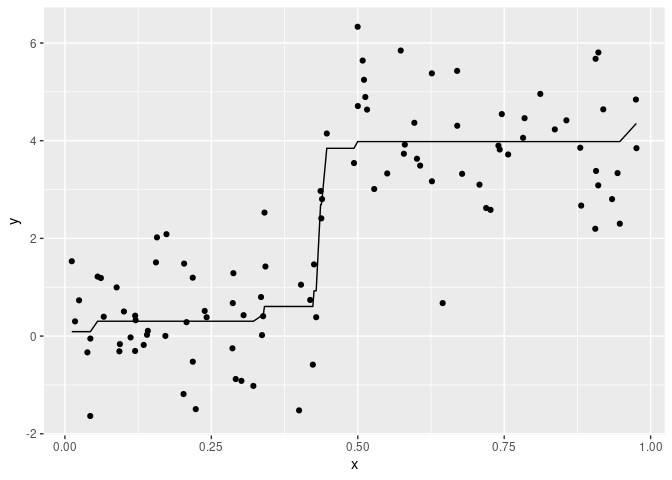
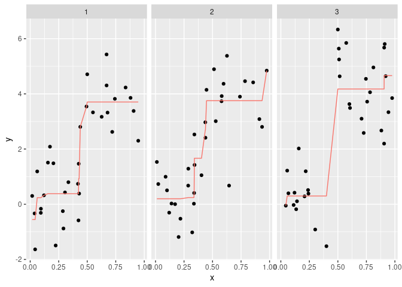

<!-- README.md is generated from README.Rmd. Please edit that file -->

# ggisotonic

<!-- badges: start -->
<!-- badges: end -->

`ggisotonic` introduces a ggplot layer `stat_isotonic` to add isotonic
or monotonic regression curves similar to `ggplot2::geom_smooth`.

## Installation

You can install the released version of ggisotonic from github with:

``` r
remotes::install_github("talegari/ggisotonic")
```

## Example

``` r
library(ggisotonic)
library("ggplot2")
dataset = data.frame(x = sort(runif(1e2)),
                     y = c(rnorm(1e2/2), rnorm(1e2/2, mean = 4)),
                     w = sample(1:3, 1e2, replace = TRUE)
                     )

# plot unweighted isotonic regression line
ggplot(dataset, aes(x = x, y = y)) +
    geom_point() +
    stat_isotonic(aes(w = 1))
```



``` r
# plot weighted isotonic regression line
ggplot(dataset, aes(x = x, y = y)) +
    geom_point() +
    stat_isotonic(aes(w = w, color = 'red'), show.legend = FALSE) +
    facet_wrap(w ~ .)
```


