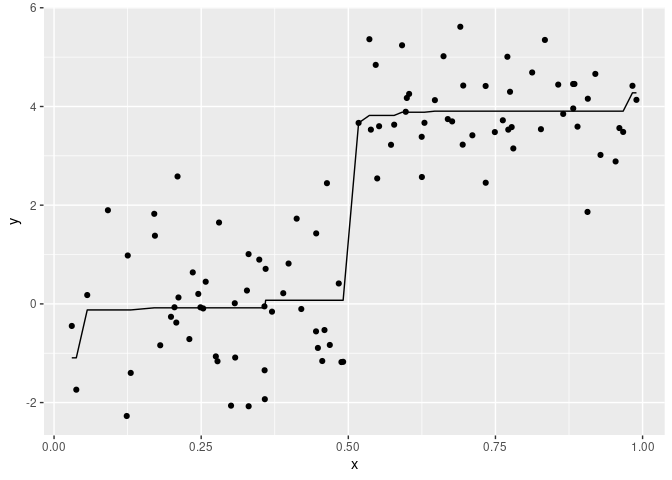
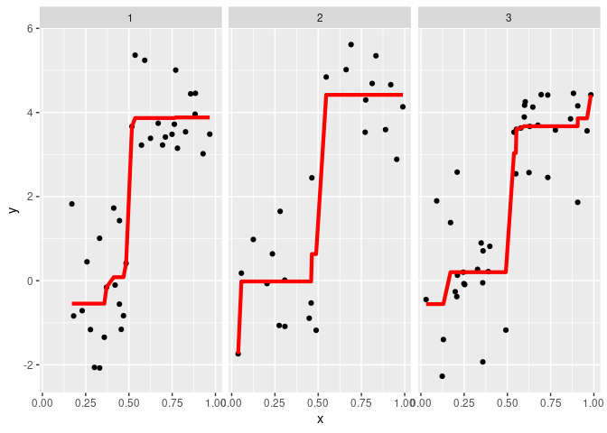

<!-- README.md is generated from README.Rmd. Please edit that file -->

# ggisotonic

<!-- badges: start -->
<!-- badges: end -->

`ggisotonic` introduces a ggplot layer `stat_isotonic` to add isotonic
or monotonic regression curves similar to `ggplot2::geom_smooth`.

## Installation

``` r
install.packages("ggisotonic")
library("ggisotonic")
```

You can install the released version of ggisotonic from github with:

``` r
remotes::install_github("talegari/ggisotonic")
```

## Example

``` r
library("ggplot2")
set.seed(100)
dataset = data.frame(x = sort(runif(1e2)),
                    y = c(rnorm(1e2/2), rnorm(1e2/2, mean = 4)),
                    w = sample(1:3, 1e2, replace = TRUE)
                    )
print(head(dataset))
#>            x          y w
#> 1 0.03014575 -0.4470622 3
#> 2 0.03780258 -1.7385979 2
#> 3 0.05638315  0.1788648 2
#> 4 0.09151028  1.8974657 3
#> 5 0.12348723 -2.2719255 3
#> 6 0.12523909  0.9804641 2
```

``` r
# plot isotonic regression line
ggplot(dataset, aes(x = x, y = y)) +
   geom_point() +
   stat_isotonic()
```



``` r
# plot weighted isotonic regression line along with facets
ggplot(dataset, aes(x = x, y = y)) +
   geom_point() +
   stat_isotonic(aes(w = w), color = 'red', size = 1.5, show.legend = FALSE) +
   facet_wrap(w ~ .)
```


